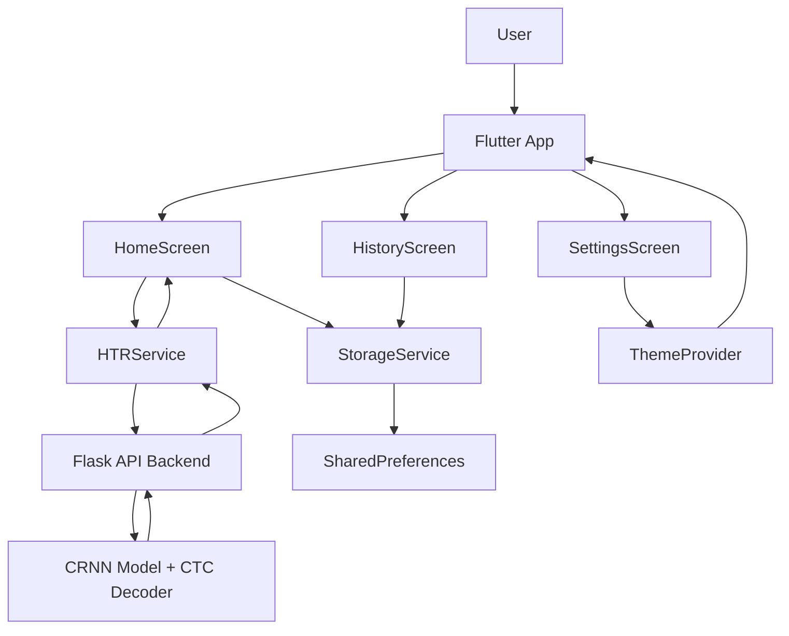
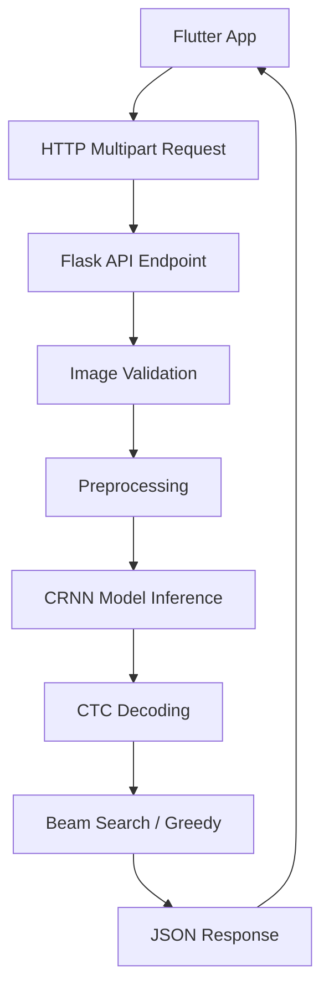

# HTR Flutter App - Architecture & Design

Dokumentasi teknis tentang arsitektur dan design decisions dari Flutter app.

---

## 🏗️ Architecture Overview

### Layered Architecture

```
┌─────────────────────────────────────────┐
│         UI Layer (Screens)              │
│  [HomeScreen] [HistoryScreen]           │
│  [SettingsScreen]                       │
└────────────────┬────────────────────────┘
                 │
┌────────────────▼────────────────────────┐
│      State Management Layer             │
│  [Provider: ThemeProvider]              │
│  [StorageService Calls]                 │
└────────────────┬────────────────────────┘
                 │
┌────────────────▼────────────────────────┐
│      Business Logic Layer               │
│  [HTRService: API Calls]                │
│  [StorageService: Local Data]           │
└────────────────┬────────────────────────┘
                 │
┌────────────────▼────────────────────────┐
│      Data Layer                         │
│  [SharedPreferences: Local Storage]     │
│  [HTTP: Remote API]                     │
│  [ImagePicker: Device Storage]          │
└─────────────────────────────────────────┘
```

---

## 📐 Design Patterns Used

### 1. **Provider Pattern** (State Management)
```dart
// ThemeProvider
ChangeNotifierProvider(
  create: (_) => ThemeProvider(),
  child: App(),
)
```

**Why?**
- Simple untuk small-medium apps
- Built-in Flutter context
- Efficient rebuilds
- Easy to test

### 2. **Service Locator Pattern** (Dependency Injection)
```dart
// In main.dart
MultiProvider(
  providers: [
    Provider<StorageService>(create: (_) => storageService),
  ],
)
```

**Why?**
- Decouple services dari UI
- Easier testing dengan mock services
- Single responsibility principle
- Reusability across screens

### 3. **Repository Pattern** (Data Access)
- `HTRService`: Mengabstraksi API calls
- `StorageService`: Mengabstraksi local storage
- Screens tidak langsung call HTTP/preferences

**Why?**
- Centralize data logic
- Easy to switch implementations
- Testable
- Consistent error handling

### 4. **Model-View Pattern**
```dart
class UploadItem {  // Model
  final String id;
  final DateTime uploadDate;
  // ... properties
}

// Used in all screens for type safety
```

**Why?**
- Type safety
- Data validation
- Serialization/Deserialization
- Single source of truth

---

## 🗂️ Detailed Architecture

### Screen Layer (UI)

#### HomeScreen
- **Purpose**: Image upload & recognition
- **State**: Image file, recognition result, processing status
- **Dependencies**: HTRService, StorageService
- **Responsibilities**:
  - Image picker logic
  - Display UI components
  - Trigger recognition
  - Show results

```dart
class HomeScreen extends StatefulWidget {
  // Manages:
  // - _selectedImage: File?
  // - _recognitionResult: String?
  // - _isProcessing: bool
  // - _recognitionMode: ('line' | 'paragraph')
  // - _useBeamSearch: bool
}
```

#### HistoryScreen
- **Purpose**: View past uploads
- **State**: List of uploads from storage
- **Dependencies**: StorageService
- **Responsibilities**:
  - Load history from storage
  - Display list with pagination
  - Delete items
  - Show details dialog

```dart
class HistoryScreen extends StatefulWidget {
  // Fetches:
  // - List<UploadItem> from StorageService
  // - Shows in ListView
}
```

#### SettingsScreen
- **Purpose**: App configuration & info
- **State**: Theme preference
- **Dependencies**: ThemeProvider
- **Responsibilities**:
  - Dark/light mode toggle
  - Display app info
  - Show API documentation
  - Explain features

```dart
class SettingsScreen extends StatefulWidget {
  // Displays:
  // - ThemeProvider.isDarkMode
  // - App version, developer info
  // - Feature list
  // - API endpoint docs
}
```

### Service Layer (Business Logic)

#### HTRService
```dart
class HTRService {
  static const String baseUrl = 'http://localhost:5000';
  
  // Methods:
  Future<bool> healthCheck()
  Future<Map> getModelInfo()
  Future<String> recognizeLine(XFile image, {useBeamSearch})
  Future<List<String>> recognizeParagraph(XFile image, {segmentationMethod})
  Future<String> getPreprocessingPreview(XFile image)
}
```

**Flow**:
```
Image (XFile)
    ↓
HTTP Multipart Request
    ↓
Flask API Processing
    ↓
JSON Response
    ↓
Parse & Validate
    ↓
Return Result (String)
```

**Error Handling**:
```dart
try {
  // Request
} on SocketException {
  // Network error
} on TimeoutException {
  // Timeout
} catch (e) {
  // Generic error
}
```

#### StorageService
```dart
class StorageService {
  // Local storage using SharedPreferences
  
  // Methods:
  Future<List<UploadItem>> getUploadHistory()
  Future<void> addUploadToHistory(UploadItem)
  Future<void> updateUploadItem(UploadItem)
  Future<void> deleteUploadItem(String id)
  Future<void> clearAllHistory()
  Future<Map> getUploadStats()
}
```

**Storage Schema**:
```
SharedPreferences {
  'upload_history': [
    {
      'id': 'uuid-string',
      'imagePath': '/path/to/image.png',
      'recognizedText': 'Recognized text...',
      'uploadDate': '2026-03-16T10:30:00Z',
      'isProcessing': false,
      'errorMessage': null
    },
    // ... more items
  ],
  'isDarkMode': false,
  'api_url': 'http://localhost:5000'
}
```

### Theme Layer (State Management)

#### ThemeProvider
```dart
class ThemeProvider extends ChangeNotifier {
  bool _isDarkMode = false;
  
  Future<void> init() // Load from storage
  Future<void> toggleTheme()
  Future<void> setTheme(bool isDark)
  
  static ThemeData lightTheme()
  static ThemeData darkTheme()
}
```

**Theme Structure**:
```dart
ThemeData {
  brightness: Brightness.light/dark,
  colorScheme: ColorScheme(seedColor: Color),
  appBarTheme: AppBarTheme,
  textTheme: TextTheme,
  elevatedButtonTheme: ElevatedButtonThemeData,
  cardTheme: CardTheme,
}
```

### Data Layer (Models)

#### UploadItem Model
```dart
class UploadItem {
  // Required
  final String id;
  final String imagePath;
  final DateTime uploadDate;
  
  // Optional
  final String? recognizedText;
  final bool isProcessing;
  final String? errorMessage;
  
  // Methods
  Map<String, dynamic> toJson()
  factory UploadItem.fromJson(Map)
  UploadItem copyWith({...})
}
```

**Data Flow**:
```
API Response JSON
    ↓
Model.fromJson()
    ↓
UploadItem instance
    ↓
Display in UI
    ↓
toJson()
    ↓
Save to SharedPreferences
```

---

## 🔄 Data Flow Examples

### Example 1: Image Upload & Recognition

```
User Action: Tap "Recognize"
    ↓
HomeScreen.recognizeText()
    ↓
HTRService.recognizeLine(image)
    ↓
MultipartRequest → Flask API
    ↓
API Response: {'success': true, 'text': '...'}
    ↓
Parse JSON
    ↓
setState(_recognitionResult = text)
    ↓
UI rebuilds showing result
    ↓
User taps "Save"
    ↓
StorageService.addUploadToHistory(UploadItem)
    ↓
Save to SharedPreferences
    ↓
showSnackBar("Saved")
```

### Example 2: Theme Toggle

```
User Action: Toggle Dark Mode Switch
    ↓
SettingsScreen → Consumer<ThemeProvider>
    ↓
ThemeProvider.setTheme(true)
    ↓
Save to SharedPreferences
    ↓
notifyListeners()
    ↓
Consumer rebuilds
    ↓
MaterialApp reads themeMode
    ↓
Apply dark theme
```

### Example 3: Load History

```
HistoryScreen.initState()
    ↓
_loadHistory() → StorageService.getUploadHistory()
    ↓
Read from SharedPreferences
    ↓
Parse JSON list
    ↓
Create List<UploadItem>
    ↓
setState(_historyFuture)
    ↓
FutureBuilder displays list
    ↓
User scrolls → ListView renders items
    ↓
User selects item → Show detail dialog
```

---

## 🧪 Testability

### Service Testing Example

```dart
// Mock HTRService
class MockHTRService extends Mock implements HTRService {}

test('recognizeLine returns text', () async {
  final mockService = MockHTRService();
  when(mockService.recognizeLine(any))
    .thenAnswer((_) async => 'test text');
  
  final result = await mockService.recognizeLine(mockImage);
  expect(result, equals('test text'));
});
```

### Widget Testing Example

```dart
testWidgets('HomeScreen displays upload button', (WidgetTester tester) async {
  await tester.pumpWidget(const MyApp());
  
  expect(find.byIcon(Icons.image_outlined), findsOneWidget);
  expect(find.byIcon(Icons.photo_library), findsOneWidget);
});
```

---

## 🔐 Security Considerations

### Sensitive Data
- ❌ API keys in code → ✅ Use environment variables
- ❌ Hardcoded credentials → ✅ Use secure storage
- ❌ Plain HTTP → ✅ Use HTTPS

### Input Validation
```dart
// File size check
if (file.lengthSync() > 5 * 1024 * 1024) {
  throw Exception('File too large');
}

// File type check
const allowedTypes = ['image/png', 'image/jpeg'];
if (!allowedTypes.contains(mimeType)) {
  throw Exception('Invalid file type');
}
```

### Error Handling
- Don't expose stack traces to users
- Log errors internally only
- Show user-friendly messages

---

## 📈 Performance Optimization

### Image Optimization
```dart
// Use imageQuality parameter
await picker.pickImage(
  source: ImageSource.gallery,
  imageQuality: 100,  // 0-100, lower = smaller
);
```

### Network Optimization
```dart
// Connection timeout
.timeout(const Duration(seconds: 30))

// Gzip compression (automatic with HTTP)
// Keep-alive connections
```

### Memory Management
```dart
// Clear unnecessary state
setState(() {
  _selectedImage = null;
  _recognitionResult = null;
});

// Dispose streams
@override
void dispose() {
  _controller.dispose();
  super.dispose();
}
```

### Build Optimization
```bash
# Profile mode (faster than debug)
flutter run --profile

# Tree-shake unused code
flutter build apk --split-per-abi

# Split by ABI reduces APK size
```

---

## 🔄 State Management Alternatives

### Current: Provider
- ✅ Simple
- ✅ Good for this app size
- ✅ Minimal boilerplate

### Alternative: GetX
- ✅ More features
- ✅ Simpler syntax
- ❌ Larger package
- ❌ Overkill for small app

### Alternative: Riverpod
- ✅ Type-safe
- ✅ More functional
- ❌ Steeper learning curve
- ❌ More boilerplate

### Alternative: BLoC
- ✅ Testable
- ✅ Scalable
- ❌ Much boilerplate
- ❌ Overkill for this app

**Decision**: Provider adalah pilihan terbaik untuk app ini karena:
- Minimal complexity
- Good performance
- Easy to understand
- Suitable for small-medium apps

---

## 📊 Scalability Considerations

### If App Grows

**Add more screens:**
- Add to navigation menu
- Follow same pattern (Service → UI)

**Add database:**
```dart
// Replace SharedPreferences with:
// - SQLite (local)
// - Firebase (cloud)
// - Supabase (open-source)
```

**Add authentication:**
```dart
// Add AuthService
// Add AuthProvider
// Add login screens
```

**Add offline sync:**
```dart
// Queue uploads when offline
// Sync when connection returns
```

---

## 🚀 Deployment Architecture

### Development
```
Device/Emulator
    ↓
Flutter App (dev)
    ↓
Flask API (localhost:5000)
```

### Production
```
Real Device
    ↓
App Store / Play Store
    ↓
Flutter App (prod)
    ↓
Flask API (Ngrok/Server)
```

### CI/CD Pipeline (Optional)
```
GitHub Push
    ↓
GitHub Actions
    ↓
Build & Test
    ↓
Deploy to VM
    ↓
Generate APK/IPA
    ↓
Distribute
```

---

## 📋 Architecture Decision Records (ADR)

### ADR-001: State Management
**Decision**: Use Provider  
**Rationale**: Good balance of simplicity and functionality  
**Alternative**: Riverpod, GetX rejected due to complexity

### ADR-002: Persistence
**Decision**: SharedPreferences  
**Rationale**: Simple local storage, no DB needed  
**Alternative**: SQLite, Hive not needed yet

### ADR-003: Network
**Decision**: HTTP package  
**Rationale**: Lightweight, built-in handling  
**Alternative**: Dio too heavy for this use case

### ADR-004: Theme Management
**Decision**: Custom ThemeProvider  
**Rationale**: Full control, simple requirements  
**Alternative**: Premade theme libraries not needed

---

## 🔗 Dependencies Justification

| Package | Size | Purpose | Assessment |
|---------|------|---------|
| http | Small | Network calls | ✅ Essential |
| image_picker | Medium | Image selection | ✅ Essential |
| provider | Small | State management | ✅ Essential |
| shared_preferences | Small | Local storage | ✅ Essential |
| intl | Medium | Date formatting | ✅ Nice to have |
| permission_handler | Medium | Permissions | ✅ Essential |
| uuid | Small | ID generation | ✅ Essential |

**Total**: ~2-3 MB of critical dependencies

---

## 💡 Design Philosophy

1. **Simplicity First**: Do only what's needed
2. **User Focused**: Clear, intuitive UI
3. **Maintainability**: Clean, documented code
4. **Testability**: Loosely coupled components
5. **Performance**: Optimize only when needed
6. **Scalability**: Built to grow

---

## Implementasi Flutter Untuk Penelitian

Bagian Flutter pada sistem ini berfungsi sebagai antarmuka pengguna untuk mengirim gambar tulisan tangan ke backend, menerima hasil prediksi model, dan menyimpan riwayat penggunaan. Jadi, Flutter tidak menjalankan model CRNN secara langsung di perangkat, tetapi bertindak sebagai client yang memanggil API backend Flask.

Alur kerjanya adalah sebagai berikut:

1. Aplikasi dijalankan dari `main.dart`.
2. `ThemeProvider` dan `StorageService` diinisialisasi lebih awal.
3. `HomeNavigation` menampilkan tiga layar utama: Home, History, dan Settings.
4. Pengguna memilih gambar dari galeri atau kamera di `HomeScreen`.
5. Gambar dikirim ke backend melalui `HTRService` dengan request HTTP multipart.
6. Backend memproses gambar menggunakan model HTR dan mengembalikan hasil teks dalam format JSON.
7. Hasil prediksi ditampilkan di layar dan dapat disimpan ke history lokal.
8. Riwayat disimpan menggunakan `SharedPreferences` melalui `StorageService`.
9. Pengguna dapat mengubah tema aplikasi melalui `ThemeProvider`.

### Diagram Arsitektur Flutter



### Narasi Singkat Untuk Bab Metode

Implementasi Flutter pada penelitian ini menggunakan arsitektur berlapis sederhana. Lapisan antarmuka dibangun dengan widget Flutter, lapisan logika aplikasi dipisahkan ke service class, sedangkan penyimpanan lokal dikelola melalui `SharedPreferences`. Pemilihan gambar, pengiriman data ke backend, dan penampilan hasil recognition dilakukan di layer UI melalui `HTRService`. Dengan pendekatan ini, aplikasi menjadi lebih mudah dipelihara karena tampilan, logika, dan penyimpanan data dipisahkan secara jelas.

### Komponen Utama

- `main.dart`: entry point aplikasi, inisialisasi provider, dan navigasi utama.
- `HomeScreen`: halaman unggah gambar dan proses recognition.
- `HistoryScreen`: halaman riwayat hasil recognition.
- `SettingsScreen`: halaman pengaturan tema dan konfigurasi API.
- `HTRService`: penghubung Flutter ke backend Flask.
- `StorageService`: pengelola history dan konfigurasi lokal.
- `UploadItem`: model data untuk item history.

---

## Implementasi Flask Untuk Penelitian

Backend Flask berfungsi sebagai penghubung antara aplikasi Flutter dan model HTR yang telah dilatih. Tugas utama backend ini adalah menerima gambar dari Flutter, melakukan validasi dan preprocessing, menjalankan inferensi model CRNN, lalu mengirimkan hasil teks kembali ke aplikasi mobile dalam bentuk JSON.

### Alur Kerja Backend

1. Flutter mengirim gambar ke endpoint Flask melalui request HTTP multipart.
2. Flask menerima request pada route seperti `/api/recognize/line` atau `/api/recognize/paragraph`.
3. Backend memeriksa format file, membaca gambar, dan mengubahnya menjadi grayscale.
4. Gambar diproses sesuai ukuran input model, yaitu tinggi 64 dan lebar 512.
5. Model CRNN dijalankan untuk menghasilkan prediksi karakter per timestep.
6. Hasil prediksi didekode menggunakan greedy decoding atau beam search.
7. Jika language model tersedia, beam search dapat dipadukan dengan rescoring LM.
8. Hasil akhir dikirim kembali ke Flutter sebagai respons JSON.

### Diagram Arsitektur Backend



### Komponen Utama Backend

- `app.py`: mendefinisikan API, route, dan alur request-response.
- `config.py`: menyimpan konfigurasi model, server, preprocessing, dan decoding.
- `model_loader.py`: memuat model CRNN, encoder karakter, language model, dan inference engine.
- `requirements.txt`: daftar dependensi Flask dan library pendukung.

### Endpoint Utama

- `GET /api/health`: memeriksa status server dan model.
- `GET /api/model/info`: menampilkan informasi model.
- `POST /api/recognize/line`: mengenali teks dari satu baris tulisan tangan.
- `POST /api/recognize/paragraph`: mengenali teks dari paragraf atau form.
- `POST /api/preprocess`: menampilkan hasil preprocessing gambar untuk debugging.

### Narasi Singkat Untuk Bab Metode

Implementasi backend pada penelitian ini menggunakan Flask sebagai REST API yang menjembatani aplikasi Flutter dengan model CRNN. Sistem bekerja dengan pola client-server, di mana Flutter bertindak sebagai client untuk mengirim gambar, sedangkan Flask bertindak sebagai server yang melakukan preprocessing, inferensi model, decoding hasil, dan pengembalian output dalam format JSON. Pendekatan ini memisahkan antarmuka pengguna dari proses komputasi model sehingga aplikasi lebih modular, mudah diuji, dan lebih mudah dikembangkan.

---

## 📚 Further Reading

### Object-Oriented Design
- SOLID Principles
- Design Patterns (Singleton, Observer, Factory)
- Clean Architecture

### Flutter Specific
- Widget lifecycle
- State management patterns
- Navigation patterns
- Testing patterns

### Mobile Architecture
- MVC vs MVP vs MVVM
- Clean Architecture
- Layered Architecture

---

**Version**: 1.0.0  
**Last Updated**: March 16, 2026  
**Status**: ✅ Complete
